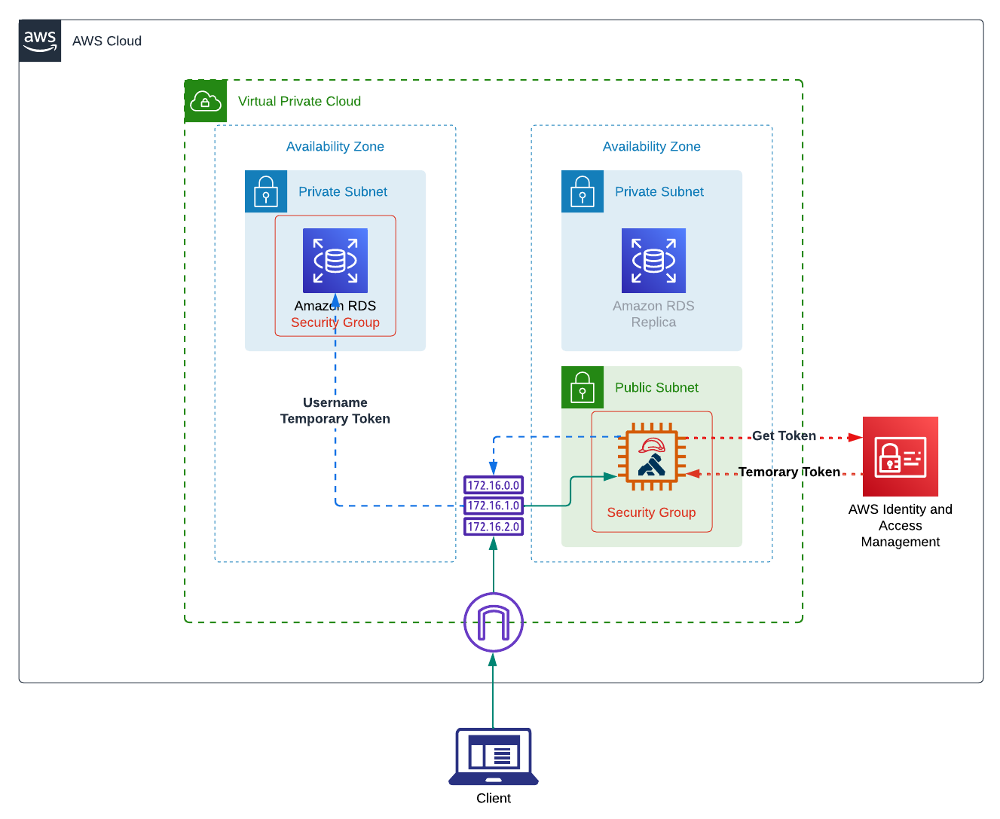

## EC2 authenticate to RDS using IAM role

This repo helps you to deploy the infrastructure on AWS to test IAM authenticate to RDS from EC2.

For detail information, please check the blog post [here](https://tech.aufomm.com/how-to-use-kong-to-authenticate-aws-rds-with-iam/).